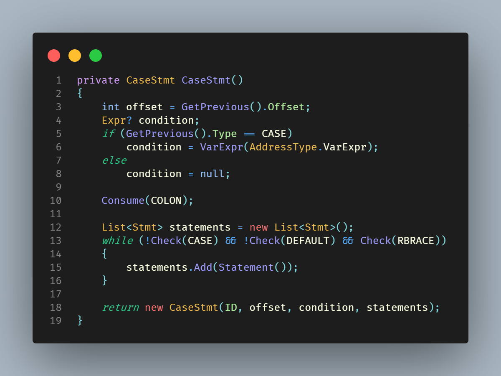

# Penguin Theme for VS Code

I created this theme because I wasn't satisfied with the themes available. I found that most of the ones I liked had no support for semantic highlighting, a feature I think is great.

The Penguin theme is by far not complete and I still have to work on adding support for more languages and tokens, as well as do some fine tuning on the colours and _change some of them completely_. This means that the feel of the theme may change in the future.

## Examples

C# + [Fira Code](https://github.com/tonsky/FiraCode)

## Contribute

If you want to contribute, just create an issue or a pull request.
You can also reach me via mail: <coozypenguin@gmail.com>

## License

This repository is licensed under the [MIT-License](LICENSE).
